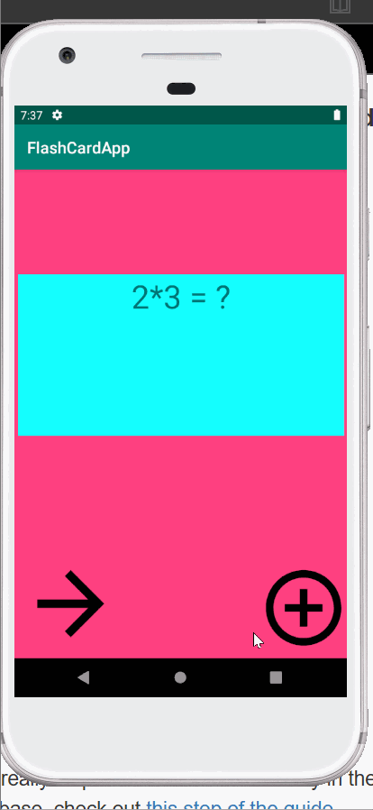

# Flashcard-Lab3
### App Description
Lab three of the flashcard app for codepath
These are the features of the app I have completed
### App Walk-though
 
### Required User Stories
- [X] Start by opening Android Studio and running your app to make sure everything still works as expected
- [X]  Add the necessary dependencies to start setting up the app's database
- [X] Create the database related files
- [X] Allow user to create a card and still see their created card when the app is relaunched.
- [X] User should be able to create multiple cards and browse through their deck of created cards
### Optional User Stories
- []  User should be able to delete a card and no longer see it in their deck anymore
- [] Randomize the order in which the cards are shown
- [] (Difficult optional!) User should be able to edit a card and see the edit saved when they browse through their deck of cards
- []  (Difficult optional!) Multiple choice
